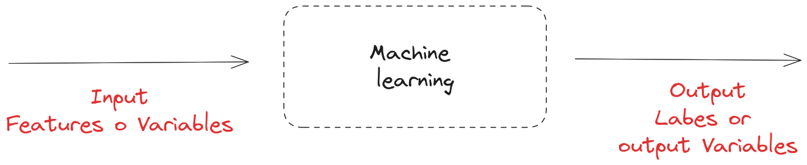
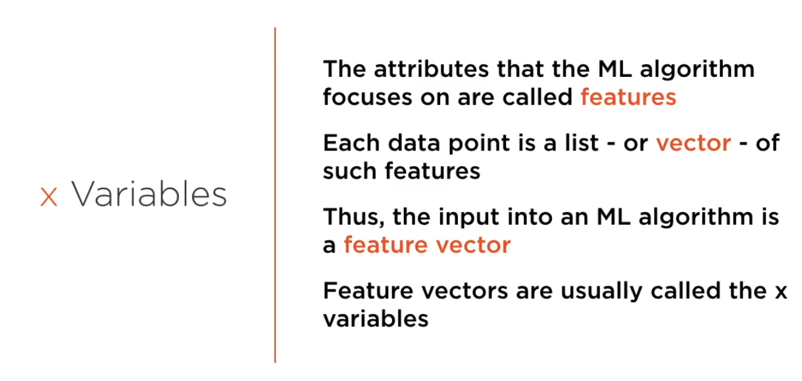

# Features and Labels

In the context of machine learning, "features" and "labels" are fundamental concepts that are essential for understanding how machine learning models are trained and how they make predictions.

### Features

- **Concept**: Features, also known as attributes or input variables, are the data attributes used to make predictions. They are the variables that the model uses to learn patterns. For instance, in a dataset for house price prediction, features could include the size of the house, number of rooms, location, age of the property, etc.

- **Why Use Them**: Features are crucial as they provide the data based on which models make predictions or decisions. The quality and relevance of features directly impact the model's performance. Good features capture the essential aspects of the data needed for learning.

- **Methods**:
  - **Feature Selection**: Choosing the most relevant features from the dataset.
  - **Feature Extraction**: Creating new features from existing ones (e.g., Principal Component Analysis).
  - **Feature Engineering**: Modifying and creating features to improve model performance.

### Labels

- **Concept**: Labels are the output variables or the data that the model is trying to predict. In supervised learning, labels are used to train the model, as they are the 'answers' the model tries to learn to predict. For example, in a spam detection system, the label for each email would be "spam" or "not spam."

- **Why Use Them**: Labels are essential in supervised learning as they provide the ground truth that the model aims to learn. The accuracy of a model's predictions is determined based on how well it predicts these labels on new, unseen data.

- **Methods**:
  - **Label Encoding**: Converting labels into a numeric format so that they can be processed by machine learning algorithms.
  - **One-hot Encoding**: Used for categorical labels, it converts categories into binary columns.
  - **Multi-label Classification**: When each data instance may have multiple labels.

### In Summary
- In machine learning, the model learns from the features to predict the labels.
- The choice and processing of features and labels are critical to the success of a machine learning model.
- In unsupervised learning, labels are not used as the goal is to uncover hidden patterns in data without pre-defined categories or outcomes. 

