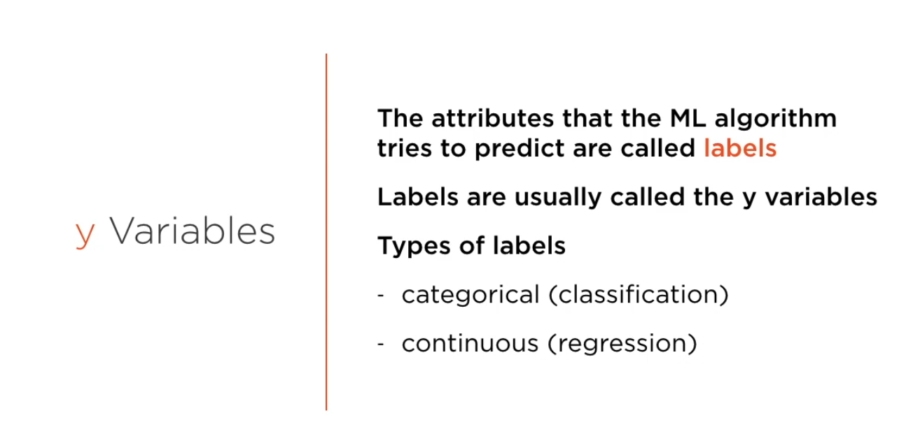
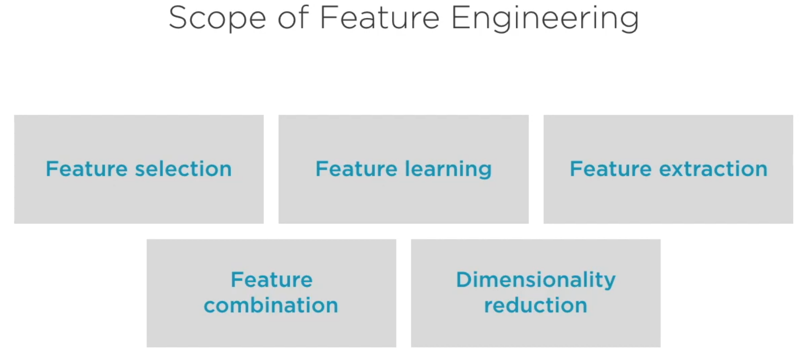
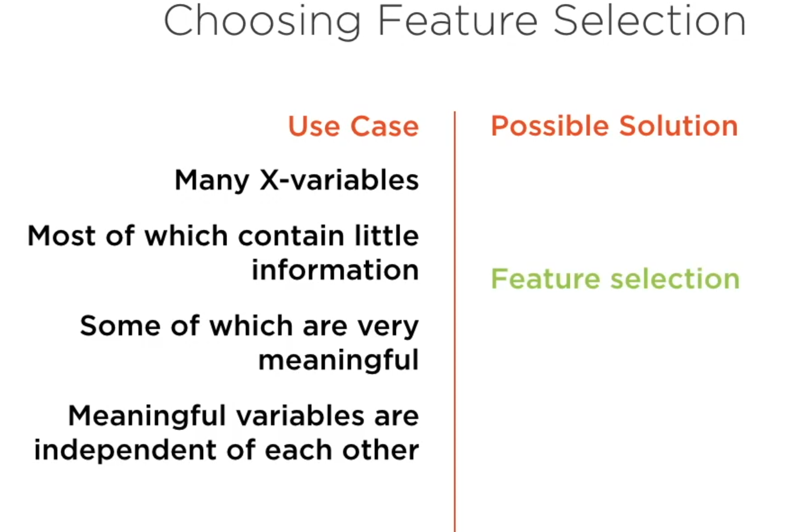

# Features and Labels

In the context of machine learning, "features" and "labels" are fundamental concepts that are essential for understanding how machine learning models are trained and how they make predictions.

### Features

- **Concept**: Features, also known as attributes or input variables, are the data attributes used to make predictions. They are the variables that the model uses to learn patterns. For instance, in a dataset for house price prediction, features could include the size of the house, number of rooms, location, age of the property, etc.

- **Why Use Them**: Features are crucial as they provide the data based on which models make predictions or decisions. The quality and relevance of features directly impact the model's performance. Good features capture the essential aspects of the data needed for learning.

- **Methods**:
  - **Feature Selection**: Choosing the most relevant features from the dataset.
  - **Feature Extraction**: Creating new features from existing ones (e.g., Principal Component Analysis).
  - **Feature Engineering**: Modifying and creating features to improve model performance.

### Labels

- **Concept**: Labels are the output variables or the data that the model is trying to predict. In supervised learning, labels are used to train the model, as they are the 'answers' the model tries to learn to predict. For example, in a spam detection system, the label for each email would be "spam" or "not spam."

- **Why Use Them**: Labels are essential in supervised learning as they provide the ground truth that the model aims to learn. The accuracy of a model's predictions is determined based on how well it predicts these labels on new, unseen data.

- **Methods**:

Feature engineering is a critical process in data science and machine learning, where raw data is transformed and prepared to improve the performance of machine learning models. Let's break down the phases you mentioned:

**Feature Selection**

   
- **Objective**: The goal of feature selection is to choose the most relevant features for the model. This process helps in reducing overfitting, improving model performance, and decreasing computational cost.

- **Methods**:
     - Filter Methods: These are based on the characteristics of the data and include techniques like correlation coefficients and Chi-square tests.
     - Wrapper Methods: These use a subset of features and train a model to evaluate their performance. Examples include forward selection, backward elimination, and recursive feature elimination.
     - Embedded Methods: These incorporate feature selection as part of the model training process, like Lasso and Ridge regression.

- **Python Libraries**: Scikit-learn, Pandas, NumPy, and Statsmodels.

**Feature Extraction**

- **Objective**: Feature extraction aims to reduce the number of features in a dataset by creating new features from the existing ones. These new features effectively capture the important information in a more compact form.

- **Methods**:
     - Principal Component Analysis (PCA): Reduces dimensionality while retaining most of the variance.
     - Linear Discriminant Analysis (LDA): Used for classification tasks to find a linear combination of features that best separates different classes.
     - t-Distributed Stochastic Neighbor Embedding (t-SNE): A non-linear technique used mainly for visualization purposes to reduce dimensions to two or three.

- **Python Libraries**: Scikit-learn, TensorFlow, Keras.

**Feature Engineering**
 
- **Objective**: The overall goal of feature engineering is to enhance model performance by creating new features and transforming existing ones. It involves understanding the underlying structure of the data and using domain knowledge.

- **Methods**:
     - Feature Transformation: Techniques like scaling, normalization, or logarithmic transformation.
     - Feature Creation: Involves creating new features from existing ones, like calculating ratios or aggregating features.
     - Handling Missing Values: Techniques to deal with missing data, like imputation.
- **Python Libraries**: Pandas, NumPy, Scikit-learn.

**Feature Learning**

- **Objective**: To automatically discover the representations needed for feature detection or classification from raw data.

- **Methods**: Deep learning techniques like Convolutional Neural Networks (CNNs) and autoencoders are common.

- **Python Libraries**: TensorFlow and PyTorch are widely used for implementing feature learning algorithms.

**Feature Combination**

- **Objective**: This involves combining two or more features to create a new feature that may provide more predictive power than the individual features.

- **Methods**: Arithmetic combinations (e.g., sum, product), grouping and aggregating features, polynomial feature combinations.

- **Python Libraries**: Pandas, NumPy.

**Dimensionality Reduction**

- **Objective**: The goal is to reduce the number of input variables in the dataset. It's particularly useful in dealing with the "curse of dimensionality" and improving model performance.

- **Methods**: Apart from PCA and LDA, other methods include Autoencoders in deep learning, Manifold learning, and Feature selection techniques.

- **Python Libraries**: Scikit-learn, TensorFlow, Keras.

### In Summary
- In machine learning, the model learns from the features to predict the labels.
- The choice and processing of features and labels are critical to the success of a machine learning model.
- In unsupervised learning, labels are not used as the goal is to uncover hidden patterns in data without pre-defined categories or outcomes. 

Feature engineering is a critical step in machine learning that involves preparing the raw data to make it suitable for a machine learning model. It encompasses several phases, each with its own objective and methods. Let's delve into each of these phases:

