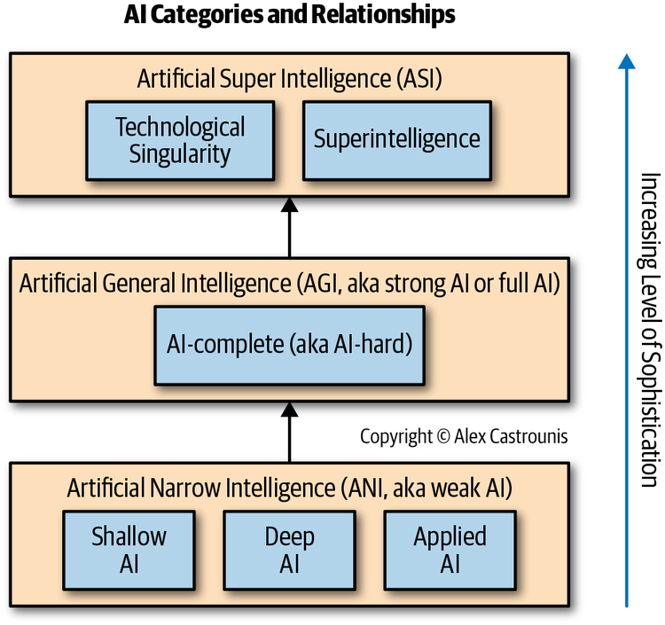
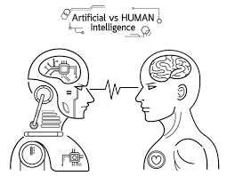
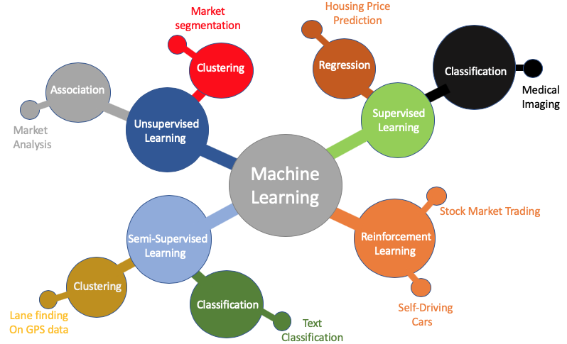

# Introduction to Machine Learning

Artificial Intelligence (AI) is a broad field of computer science that aims to create systems capable of performing tasks that typically require human intelligence. These tasks include learning, reasoning, problem-solving, perception, language understanding, and more. AI systems are designed to handle tasks in a way that mimics human cognition, either to perform specific tasks or to solve general problems.

Types of AI can be categorized based on their capabilities and functionalities:

**Narrow AI (or Weak AI)**

This type of AI is designed to perform a narrow task and is the most common form of AI in the world today. Examples include facial recognition Types of AI can be categorized based on their capabilities and functionalities:

**General AI (or Strong AI)**

General AI is a type of AI that has the ability to understand, learn, and apply its intelligence broadly in a way similar to human intelligence. It's capable of reasoning, problem-solving, and abstract thinking across a wide range of domains. As of my last update in January 2022, General AI is largely theoretical and not yet realized in practice.

**Artificial Superintelligence (ASI)**

This is a hypothetical AI that surpasses human intelligence in all aspects, from creativity and emotional intelligence to general wisdom and problem-solving. ASI represents an AI that is not only smarter than a human in specific tasks but in everything, including scientific creativity, general wisdom, and social skills.

## Artificial Intelligence vs Human Intelligence

| Human Capability | AI Equivalent | AI Techniques (with Acronyms) | AI Classification |
|------------------|---------------|-------------------------------|-------------------|
| Vision | Computer Vision | Convolutional Neural Networks (CNNs), Image Processing | Narrow AI |
| Hearing and Speech Understanding | Natural Language Processing for Speech Understanding | Neural Language Models (NLMs), Automatic Speech Recognition (ASR) | Narrow AI |
| Decision Making | Decision Support Systems | Machine Learning (ML), Fuzzy Logic (FL) | Narrow AI |
| Learning and Memory | Machine Learning | Supervised Learning (SL), Unsupervised Learning (UL), Reinforcement Learning (RL) | Narrow AI |
| Language and Communication | Natural Language Generation and Understanding | Automatic Translation, Text Generation (LLMs) | Narrow AI |
| Pattern Recognition | Pattern Recognition | Neural Networks (NNs), Deep Learning (DL) | Narrow AI |
| Mobility and Navigation | Autonomous Robotics | Autonomous Navigation Systems, Sensors and Actuators | Narrow AI |
| Creativity (Art, Music) | Creative AI | Generative Adversarial Networks (GANs) | Narrow AI |
| Reasoning and Problem-Solving | AI for Problem Solving | Rule-Based Systems, Deep Learning (DL) | Narrow AI |
| Empathy and Emotions | *Currently no equivalent* | *Future techniques in GAI/SAI* | GAI/SAI |
| Self-Awareness | *Currently no equivalent* | *Future techniques in GAI/SAI* | GAI/SAI |
| Abstract Creativity (e.g., Invention) | *Currently no equivalent* | *Future techniques in GAI/SAI* | GAI/SAI |
| Deep, Contextual Understanding of the World | *Currently no equivalent* | *Future techniques in GAI/SAI* | GAI/SAI |
| Complex Text Generation and Understanding | Large Language Models | Transformer Models (e.g., GPT, BERT) | Narrow AI |
| Creative and Generative Tasks | Generative AI | Generative Pre-trained Transformers (GPT), Variational Autoencoders (VAEs) | Narrow AI |

**Overview of Machine Learning**

Machine Learning is a subfield of artificial intelligence (AI) focused on developing systems that can learn from and make decisions based on data. Unlike traditional programming, where a programmer defines all the rules and logic for a system to make decisions, machine learning enables a system to automatically learn and improve from experience without being explicitly programmed.

In essence, machine learning involves feeding data into algorithms, which are mathematical models that process the information and 'learn' from it. This learning process can involve identifying patterns, making predictions, or making decisions based on the data. The more data these algorithms are exposed to, the more they can adjust and improve their decision-making or predictions.

There are several types of machine learning, each with its own approach and use case:
    
**Supervised Learning**: This involves learning a function that maps an input to an output based on example input-output pairs. It infers a function from labeled training data and is used for applications like regression and classification.

**Unsupervised Learning**: In unsupervised learning, the algorithm is given data without explicit instructions on what to do with it. The system tries to learn the patterns and structure from the data. Common techniques include clustering and association.

**Semi-Supervised Learning**: This is a combination of supervised and unsupervised learning. The algorithm is trained on a combination of labeled and unlabeled data, typically a small amount of labeled data with a large amount of unlabeled data.

**Self-Supervised Learning**: A form of unsupervised learning where the data provides the supervision. Here, the system generates its own labels from the input data, often by transforming the input data and learning to predict or reconstruct the original data.

**Active Learning**: This is a special case of semi-supervised learning where the algorithm can query a user (or some other information source) to obtain the desired outputs at new data points.

**Reinforcement Learning**: Here, an agent learns to make decisions by performing actions in an environment. It learns from the results of its actions, rather than from explicit teaching, to achieve a goal or maximize some notion of cumulative reward.

**Transfer Learning**: This involves taking a pre-trained model (usually on a large, general dataset) and fine-tuning it for a specific task. This is particularly useful when you have a small amount of data for the task at hand.

**Federated Learning**: A machine learning setting where the goal is to train a high-quality model across multiple decentralized devices or servers holding local data samples, without exchanging them.

**Ensemble Learning**: Methods that combine several machine learning models to improve performance. This includes popular techniques like bagging, boosting, and stacking.

**Deep Learning**: A subset of machine learning that uses neural networks with many layers (hence "deep"). It's particularly useful for processing unstructured data like images, audio, and text.

**Evolutionary Learning**: Inspired by biological evolution, this approach uses algorithms like genetic algorithms to evolve models based on their fitness in a given task.

 **Explainable AI (XAI)**: While not a separate type of learning, this is an emerging field focused on making the outputs of machine learning models interpretable and understandable to humans.

It's important to note that the field of machine learning is rapidly evolving, and new methods and subfields are continually emerging.