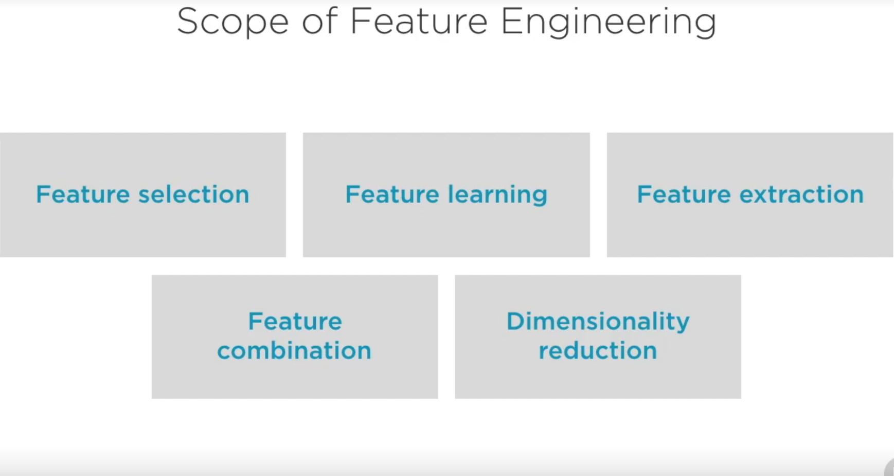
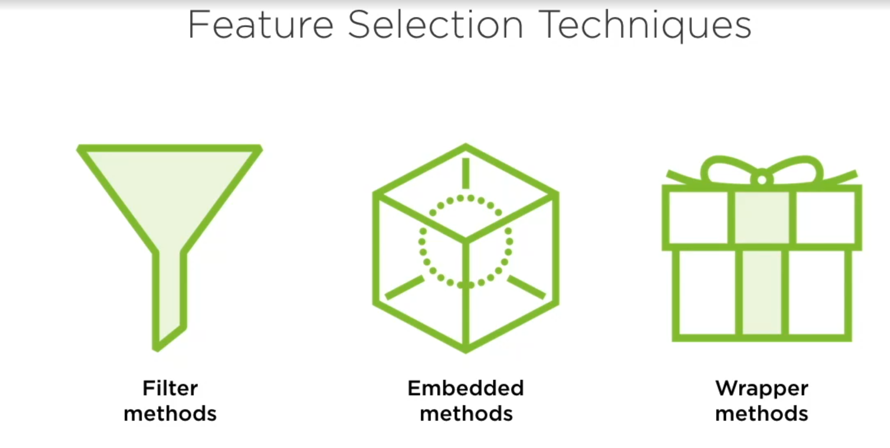

# Scope feature enginering

Feature engineering is a crucial phase in the machine learning pipeline. It involves creating new features or modifying existing ones to improve the performance of a machine learning model. The scope of feature engineering is broad and intersects with both data preprocessing and model building.

### Objectives of Feature Engineering
1. **Improving Model Accuracy**: By providing better and more informative features, models can learn more effectively.
2. **Reducing Complexity**: Better features can allow for simpler models that are easier to interpret and faster to train.
3. **Increasing Robustness**: Well-engineered features can make models less sensitive to noise and more generalizable.
4. **Handling Non-linear Relationships**: Transforming features to better capture non-linear relationships in the data.

### Why Feature Engineering

- **Enhances Data Quality**: Improves the representation of the data to suit the problem better.
- **Addresses Data Limitations**: Deals with issues such as missing values, outliers, and skewed data.
- **Domain Knowledge Integration**: Encapsulates expert knowledge in the features to make the model more insightful.

### Methods of Feature Engineering

1. **Feature Creation**
   - **Combining Features**: Creating new features by combining two or more existing features.
   - **Aggregation**: Summarizing multiple data points (e.g., mean, median, sum).
   - **Temporal Features**: Extracting date and time-based features (e.g., day of the week, month, year).
   - **Tools**: Pandas for data manipulation, NumPy for numerical operations.

2. **Feature Transformation**
   - **Normalization/Standardization**: Scaling features to a range or standardizing to have zero mean and unit variance.
   - **Log Transform**: Applying logarithmic scaling to reduce skewness.
   - **Polynomial Features**: Generating polynomial and interaction features.
   - **Tools**: Scikit-learn's `MinMaxScaler`, `StandardScaler`, `PolynomialFeatures`.

3. **Feature Encoding**
   - **One-Hot Encoding**: Representing categorical variables as binary vectors.
   - **Label Encoding**: Converting each category to a unique integer.
   - **Binary Encoding**: Combining aspects of one-hot and label encoding.
   - **Tools**: Pandas' `get_dummies`, Scikit-learn's `OneHotEncoder`, `LabelEncoder`.
   - 

4. **Feature Selection**

   - **Filter Methods**: Based on statistical tests (e.g., chi-squared test, ANOVA).
   - **Wrapper Methods**: Use a subset of features and train a model (e.g., recursive feature elimination).
   - **Embedded Methods**: Algorithms with built-in feature selection (e.g., Lasso, Ridge regression).
   - **Tools**: Scikit-learn for various feature selection methods.

5. **Dimensionality Reduction**
   - **Principal Component Analysis (PCA)**: Reducing dimensions while retaining variance.
   - **t-Distributed Stochastic Neighbor Embedding (t-SNE)**: Visualizing high-dimensional data in lower dimensions.
   - **Tools**: Scikit-learn's `PCA`, `TSNE`.

6. **Handling Missing Values**
   - **Imputation**: Replacing missing values with statistical measures (mean, median, mode).
   - **KNN Imputation**: Using K-Nearest Neighbors to estimate missing values.
   - **Tools**: Scikit-learn's `SimpleImputer`, `KNNImputer`.

7. **Handling Outliers**
   - **Statistical Methods**: Using Z-scores or IQR to detect and treat outliers.
   - **Quantile-based Flooring and Capping**: Capping and flooring extreme values.
   - **Tools**: Scipy for statistical methods, Pandas for data manipulation.

8. **Text Features (NLP specific)**
   - **Bag of Words**: Representing text data as a collection of words.
   - **TF-IDF**: Weighting words based on their frequency and inverse document frequency.
   - **Word Embeddings**: Using pre-trained models like Word2Vec, GloVe.
   - **Tools**: Scikit-learn for BoW and TF-IDF, Gensim for Word2Vec, SpaCy for NLP tasks.

### Conclusion

Feature engineering is a multifaceted process that requires creativity, domain expertise, and analytical skills. The choice of methods and tools largely depends on the nature of the data and the specific problem being addressed. Properly engineered features can significantly impact the success of a machine learning model.