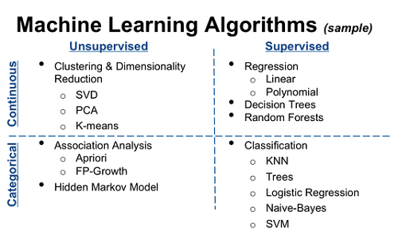

# Understanding Different Types of ML: Supervised and Unsupervised

Machine Learning (ML) can be broadly categorized into two main types: Supervised and Unsupervised Learning. Each type has its own set of algorithms, use cases, methods, and tools.

### Supervised Learning

- **Description**: Supervised learning involves training a model on a labeled dataset. This means that each example in the training dataset is paired with the correct output. The model learns to predict the output from the input data during training and is then used to make predictions on new, unseen data.

- **Algorithms**:
  - **Linear Regression**: Used for predicting continuous values.
  - **Logistic Regression**: Used for binary classification tasks.
  - **Decision Trees**: Versatile for classification and regression.
  - **Random Forest**: An ensemble of decision trees, often more powerful than a single decision tree.
  - **Support Vector Machines (SVM)**: Effective for high-dimensional spaces.
  - **Neural Networks**: Flexible and can be used for both classification and regression tasks.
- **Most Use Cases**: Spam detection, image recognition, sales forecasting, customer churn prediction, and medical diagnosis.

- **Methods and Tools**:
  - **Data Labeling**: Crucial for supervised learning as the model learns from labeled data.
  - **Feature Engineering**: Improving the model's performance by creating effective features.
  - **Cross-Validation**: For assessing how the model will generalize to an independent dataset.
  - **Regularization**: To prevent overfitting.
  - **Tools**: Python libraries like Scikit-learn, TensorFlow, and PyTorch.

### Unsupervised Learning

- **Description**: Unsupervised learning involves training a model on data that is not labeled. The goal is to explore the structure of the data to extract meaningful information without being guided by a known outcome variable.

- **Algorithms**:
  - **Clustering (e.g., K-Means, Hierarchical Clustering)**: For grouping data into clusters based on similarity.
  - **Association (e.g., Apriori, Eclat)**: For discovering rules that describe portions of your data.
  - **Principal Component Analysis (PCA)**: For dimensionality reduction.
  - **Autoencoders**: Neural network-based approach for learning efficient codings.
- **Most Use Cases**: Market basket analysis, customer segmentation, social network analysis, organizing large databases, anomaly detection.
- **Methods and Tools**:
  - **Pattern Recognition**: Identifying patterns and regularities in the data.
  - **Dimensionality Reduction**: Reducing the number of variables under consideration.
  - **Normalization**: Scaling features for algorithms that require normalized data.
  - **Tools**: Python libraries like Scikit-learn, Keras (for autoencoders), and network analysis tools like Gephi.

### Conclusion

- **Supervised Learning** is about learning a function that maps input to output based on example input-output pairs and is used when the output is known.

- **Unsupervised Learning** is used to draw inferences from datasets consisting of input data without labeled responses, and it's about finding hidden structures in unlabeled data.

Both types of learning have their own significance and are chosen based on the specific requirements and availability of data in a given machine learning task.