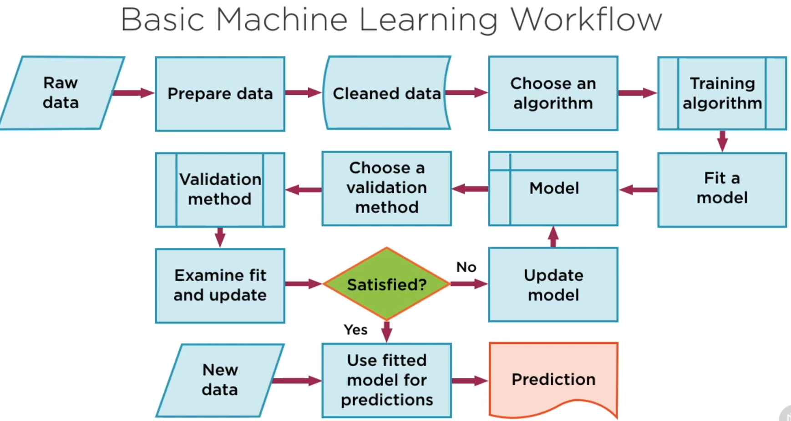

# Machine learning workflow

The machine learning (ML) workflow typically encompasses several stages, each crucial for developing effective and efficient ML models. Understanding these stages is key for anyone working in the field of ML, as it helps in structuring projects and achieving better results. Here's a general overview of the workflow:

### 1. Problem Definition
- **Key Description**: Clearly define what you want to achieve with ML. Understand the problem and its scope.
- **Objectives**: To establish a clear goal and understand how ML can provide a solution.
- **Methods**: Consultations with domain experts, literature review, setting realistic and measurable objectives.

### 2. Data Collection
- **Key Description**: Gathering relevant data needed to train the model.
- **Objectives**: To collect high-quality, relevant data that is representative of the problem to be solved.
- **Methods**: Using existing datasets, collecting new data through surveys or sensors, web scraping, public data sources.

### 3. Data Preprocessing
- **Key Description**: Preparing the data for modeling. This includes cleaning data, handling missing values, and data transformation.
- **Objectives**: To create a clean and structured dataset that can be effectively used by ML algorithms.
- **Methods**: Data cleaning, normalization, standardization, handling missing data, feature engineering.

### 4. Exploratory Data Analysis (EDA)
- **Key Description**: Analyzing the data to find patterns, anomalies, trends, and relationships between variables.
- **Objectives**: To gain insights that can guide further analysis and model building.
- **Methods**: Statistical analysis, visualization (like histograms, box plots), correlation analysis.

### 5. Feature Engineering and Selection
- **Key Description**: Creating new features from existing data and selecting the most significant features for the model.
- **Objectives**: To improve model performance by enhancing the data and reducing dimensionality.
- **Methods**: Feature extraction, feature selection techniques, dimensionality reduction.

### 6. Model Selection and Training
- **Key Description**: Choosing appropriate ML algorithms and training them on the dataset.
- **Objectives**: To develop a model that accurately predicts or classifies the target variable.
- **Methods**: Splitting data into training and testing sets, cross-validation, parameter tuning.

### 7. Model Evaluation
- **Key Description**: Assessing the performance of the model.
- **Objectives**: To determine how well the model performs and whether it meets the project objectives.
- **Methods**: Using metrics like accuracy, precision, recall, ROC-AUC for classification; MSE, RMSE for regression.

### 8. Model Optimization
- **Key Description**: Improving the model based on evaluation metrics.
- **Objectives**: To enhance the model’s performance and efficiency.
- **Methods**: Hyperparameter tuning, using more advanced algorithms, additional feature engineering.

### 9. Model Deployment
- **Key Description**: Deploying the model into a production environment where it can make predictions on new data.
- **Objectives**: To make the model available for practical use and decision-making.
- **Methods**: Using cloud services (AWS, Azure, GCP), creating APIs, embedding the model in existing applications.

### 10. Monitoring and Maintenance
- **Key Description**: Continuously monitoring the model’s performance over time and updating it as necessary.
- **Objectives**: To ensure the model remains effective and accurate as new data comes in and conditions change.
- **Methods**: Regular performance checks, updating the model with new data, adjusting to concept drift.

### Conclusion
Each stage in the ML workflow is interconnected and critical for the overall success of a project. This workflow is not strictly linear; it often requires iteration and revisiting previous stages based on insights gained in later stages. The key to a successful ML project lies in meticulous execution at each stage, combined with a deep understanding of the problem domain and the data.