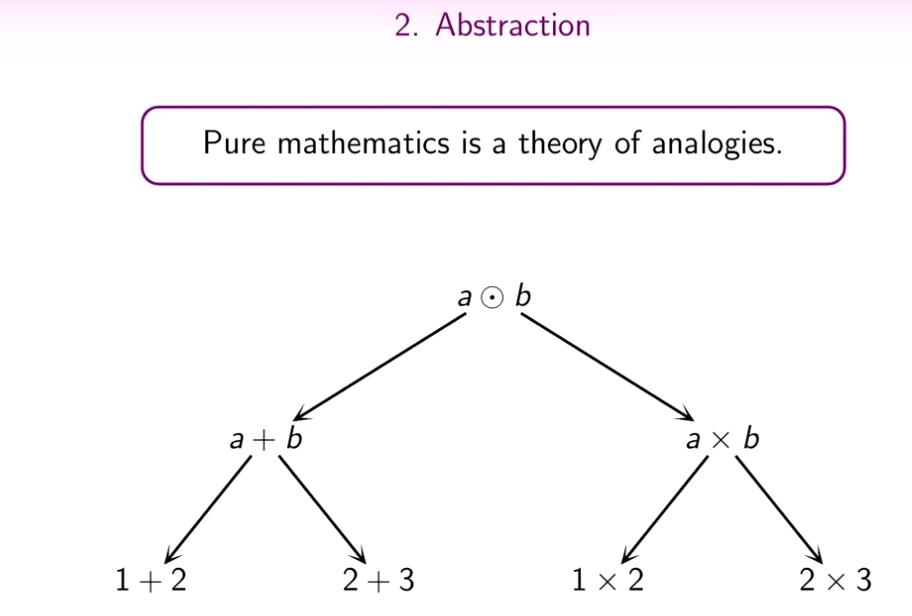
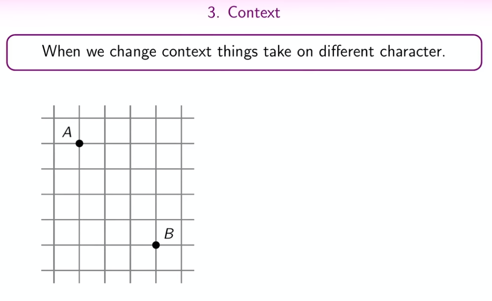
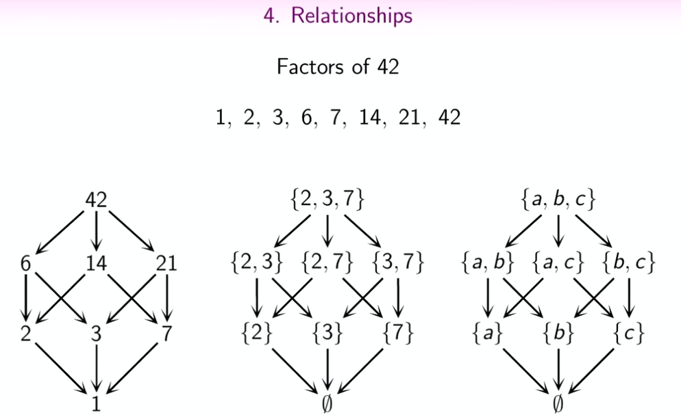
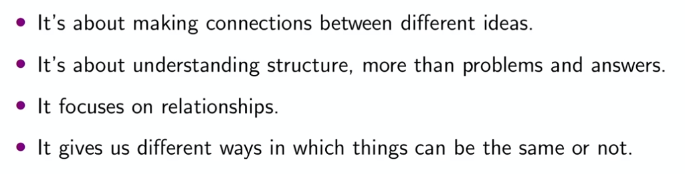
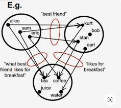
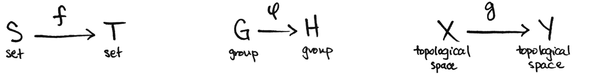

# Category theory

# Preliminaries

## Abstraction

Abstraction is a fundamental process where certain properties of objects are focused on while other properties are ignored. This allows to create general concepts and principles that can be applied across different situations.

## Context

In general, context refers to the specific circumstances, conditions, or frameworks in which something exists or occurs. It provides background information or the setting within which an idea, event, or statement is situated, and it helps in understanding the meaning and significance of that idea or event. In mathematics and other sciences, the context might include the particular problem being solved, the assumptions being made, the relevant theories and principles, and the goals of the investigation.

Category theory, a branch of mathematics, deals with abstract structures and relationships between them. Here's a simple explanation of its main concepts:

## Relationship

In a general sense, refer to the connections or associations between two or more entities. These entities could be individuals, groups, objects, ideas, or events. Relationships are characterized by interaction, influence, or a certain kind of linkage, and they can be of various types, such as causal, correlational, hierarchical, or associative.

# Category theory

**Category**: At its core, a category consists of objects and morphisms (or arrows) between these objects. Think of objects as points and morphisms as arrows connecting these points. Each morphism has a starting object (source) and an ending object (target). For example, in the category of sets, objects are sets, and morphisms are functions between these sets.

**Morphism**: A morphism is a kind of arrow from one object to another within the same category. It represents a relationship or a function between objects. The key properties of morphisms are that they can be composed (i.e., if you have an arrow from A to B and another from B to C, you can compose them to get an arrow from A to C) and that each object has an identity morphism that acts as a kind of "do-nothing" arrow, pointing from the object to itself.

A category, then, is any collection of objects that can relate to each other via morphisms in sensible ways, like composition and associativity. 

**Composition**: 
In the context of category theory, composition is a fundamental concept that refers to the way in which morphisms (or arrows) between objects can be combined.

To understand composition, consider that category theory deals with objects and morphisms. A morphism can be thought of as a kind of arrow that connects one object to another. Composition comes into play when you have two or more morphisms that can be connected end-to-end.

Here's a more detailed explanation:

- **Morphisms**: In a category, you have morphisms (f, g, h, etc.) that act like arrows connecting objects (A, B, C, etc.). For instance, if f is a morphism from object A to object B (denoted as \( f: A \rightarrow B \)), and g is a morphism from object B to object C (\( g: B \rightarrow C \)), then...

- **Composition of Morphisms**: ...you can "compose" f and g to get a new morphism that goes directly from object A to object C. This composition is typically denoted as \( g \circ f \) (read as "g following f") and is a morphism from A to C.

- **Associativity of Composition**: Composition in category theory is associative. That means if you have three morphisms \( f: A \rightarrow B \), \( g: B \rightarrow C \), and \( h: C \rightarrow D \), then \( h \circ (g \circ f) = (h \circ g) \circ f \). Both ways of composing these morphisms result in a morphism from A to D.

- **Identity Morphism and Composition**: Each object in a category has an identity morphism, denoted as \( id_A \) for object A, which serves as a kind of neutral element in composition. For any morphism \( f: A \rightarrow B \), the composition \( id_B \circ f \) is equal to \( f \), and similarly, \( f \circ id_A \) is also \( f \).

Composition is a powerful tool in category theory because it allows for the construction of complex relationships and structures from simpler ones. It's a cornerstone of the theory, enabling the abstraction and manipulation of mathematical structures.

1. **Identity Morphism**: Every object in a category has an identity morphism. It's a special kind of morphism that, when composed with any other morphism, leaves the other morphism unchanged. This is similar to the number 1 in multiplication.

2. **Functor**: A functor is a map between categories that preserves the structure of categories. It maps objects to objects and morphisms to morphisms in a way that respects composition and identity. Essentially, it's a way of transforming one category into another while maintaining its essential structure.

3. **Natural Transformation**: This is a way of transforming one functor into another while respecting the structure of the categories involved. It's a kind of "higher-level" morphism between functors.

4. **Limits and Colimits**: These are concepts that generalize constructions like products, coproducts, intersections, and unions in categories. They are a way of talking about the process of combining objects and the relationships between them.

5. **Adjunctions**: These are pairs of functors that stand in a special relationship to each other, reflecting a kind of duality or correspondence between categories.

Category theory is often considered abstract and difficult because it deals with such high-level concepts, but its power lies in its ability to unify and describe various mathematical structures and processes in a broad, abstract way.

By the way, your sentence, "Take your tieme," has a small typo. It should be "Take your time."