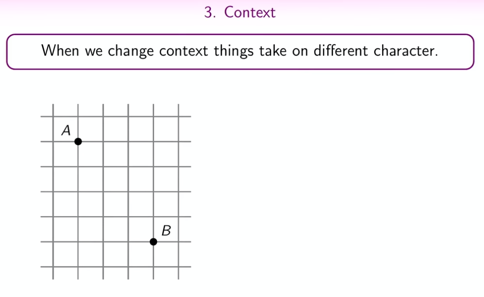
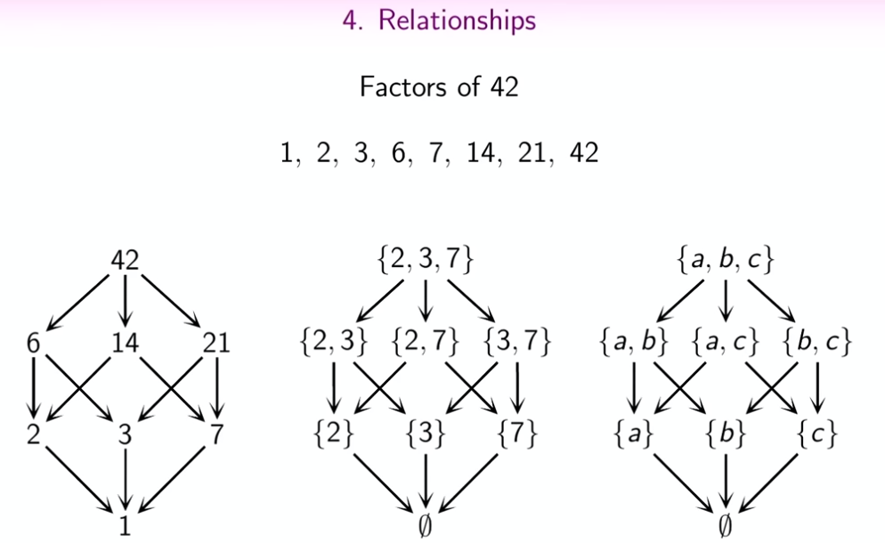
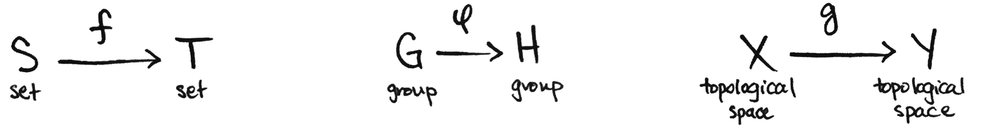
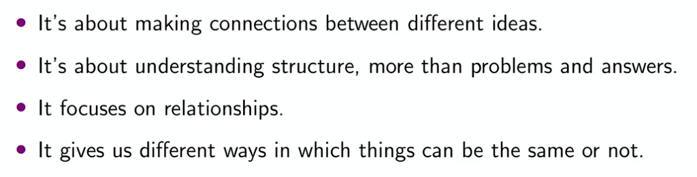

# Category theory

# Preliminaries

## Abstraction

Abstraction is a fundamental process where certain properties of objects are focused on while other properties are ignored. This allows to creation of general concepts and principles that can be applied across different situations.

## Context

In general, context refers to the specific circumstances, conditions, or frameworks in which something exists or occurs. It provides background information or the setting within which an idea, event, or statement is situated, and it helps in understanding the meaning and significance of that idea or event. In mathematics and other sciences, the context might include the particular problem being solved, the assumptions being made, the relevant theories and principles, and the goals of the investigation.

Category theory, a branch of mathematics, deals with abstract structures and the relationships between them. Here's a simple explanation of its main concepts:

## Relationship

In a general sense, refer to the connections or associations between two or more entities. These entities could be individuals, groups, objects, ideas, or events. Relationships are characterized by interaction, influence, or a certain kind of linkage, and they can be of various types, such as causal, correlational, hierarchical, or associative.

# Category theory

## Object

In category theory, an object can be thought of as a fundamental unit or point within a category. The nature of these objects is not specified by the theory itself; they can be anything as long as they adhere to the structure of the category they are in. For example, in the category of sets, objects are sets; in the category of groups, objects are groups. Objects in category theory are abstract and are not necessarily tangible in the traditional sense.

## Set of Objects

While category theory deliberately avoids too much reliance on set theory due to foundational issues (like Russell's paradox), we can still informally think of the collection of all objects in a particular category as a "set of objects." This concept helps when conceptualizing a category as a whole, comprising all the objects it contains. However, it's important to note that in more advanced or formal discussions of category theory, the treatment of these collections can become more nuanced to avoid set-theoretic paradoxes.

**Morphism**: A morphism is a kind of arrow from one object to another within the same category. It represents a relationship or a function between objects. The key properties of morphisms are that they can be composed (i.e., if you have an arrow from A to B and another from B to C, you can compose them to get an arrow from A to C) and that each object has an identity morphism that acts as a kind of "do-nothing" arrow, pointing from the object to itself.

A category, then, is any collection of objects that can relate to each other via morphisms in sensible ways, like composition and associativity. 

**Composition**: 

In category theory, composition is a concept that describes how two processes (morphisms) can be combined to form a single process. Imagine morphisms as arrows connecting points (objects). Composition is like connecting these arrows end-to-end to create a new arrow that represents the combined process.

Composition is a powerful tool in category theory because it allows for the construction of complex relationships and structures from simpler ones. It's a cornerstone of the theory, enabling the abstraction and manipulation of mathematical structures.

**Identity Morphism**

Every object in a category has an identity morphism. It's a special kind of morphism that, when composed with any other morphism, leaves the other morphism unchanged. This is similar to the number 1 in multiplication.

**Domain**: In category theory, the domain of a morphism (which can be thought of as an arrow) is the object from which the morphism originates. If you have a morphism represented as an arrow going from one object to another, the domain is the object at the tail of the arrow. It's the starting point of the morphism. For example, if you have a morphism \( f \) that goes from an object \( A \) to an object \( B \), then the domain of \( f \) is \( A \).

**Codomain**: The codomain in category theory is the object to which the morphism points or the object at the head of the arrow. It's where the morphism ends or the target of the morphism. Continuing with the previous example, for the morphism \( f: A \rightarrow B \), the codomain of \( f \) is \( B \).

These concepts are crucial for defining and understanding morphisms in category theory. A morphism is essentially a relation between its domain and codomain, and much of category theory involves studying the properties and compositions of these morphisms.

In summary, the category is:

Formal definition

## Examples

| Applications | Subtype of Application          | Example                                                                                         |
|--------------|---------------------------------|-------------------------------------------------------------------------------------------------|
| Nature       | Ecosystems                      | Ecosystems as categories with species as objects and ecological relationships as morphisms      |
| Nature       | Evolutionary Processes          | Species as objects and evolutionary transformations as morphisms                                |
| Nature       | Neural Networks in Biology      | Neurons as objects and synaptic connections as morphisms                                        |
| Business     | Organizations                   | Departments as objects and interdepartmental relations as morphisms                             |
| Business     | Supply Chains                   | Steps in a supply chain as objects and transactions/movements of goods as morphisms             |
| Business     | Business Process Modeling       | Business process states as objects and transitions as morphisms                                 |
| Technology   | Software Design                 | Classes as objects and functions/methods as morphisms in object-oriented programming            |
| Technology   | Computer Networks               | Computers/nodes as objects and network connections as morphisms                                 |
| Technology   | Databases and Data Structures   | Entities in a database as objects and relations between them as morphisms                       |
| Technology   | AI and Machine Learning         | AI models as objects and data transformations or learning as morphisms                          |

This table provides a clear and concise overview of various applications of category theory in different fields.

## Notations

## What is not a category ?

