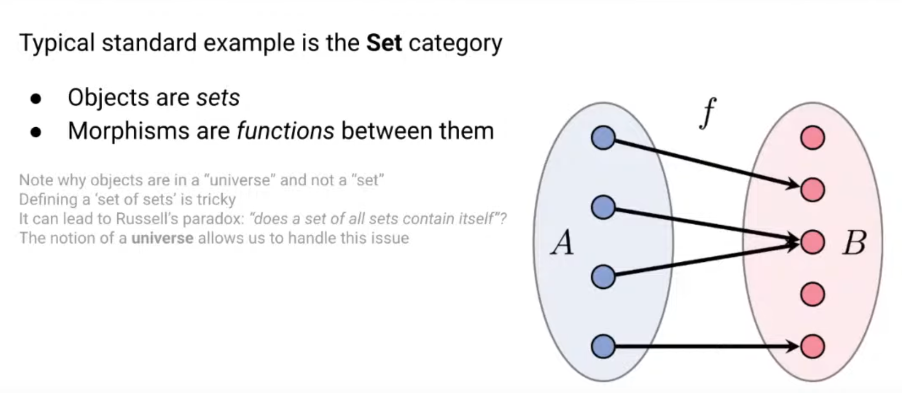
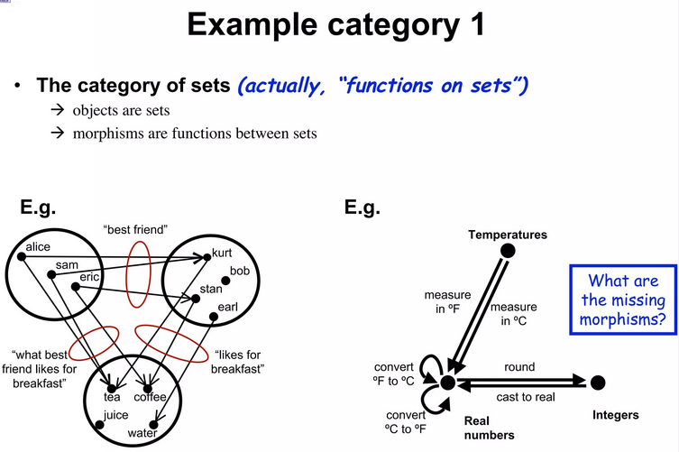

# Set Category

In the context of category theory, a "Set" refers to an object within the category of sets, typically denoted as **Set**. This category is one of the most fundamental and commonly studied in category theory, and it is defined as follows:

1. **Objects:** The objects in the category **Set** are sets. A set can be thought of as a collection of distinct elements. Examples include the set of natural numbers, the characters in a string, or even other sets.

2. **Morphisms:** The morphisms in **Set** are functions between sets. A function \( f: A \to B \) maps each element of a set \( A \) (called the domain) to an element of the set \( B \) (called the codomain).

3. **Identities and Composition:** Every set \( A \) has an identity function, which maps each element of \( A \) to itself. The composition of functions (i.e., applying one function after another) is also defined in this category.

The category **Set** is fundamental because it serves as a model for many other mathematical structures. In category theory, other categories are often defined in terms of how they relate to **Set**. For example, a category might have objects that are sets with additional structures (like groups, topological spaces, etc.) and morphisms that are functions between these sets preserving the additional structure.

Examples

In summary, in category theory, a "Set" refers to a set viewed as an object within the category of sets, where functions between sets act as the morphisms.
